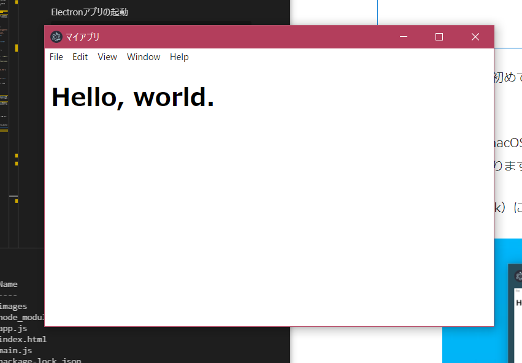
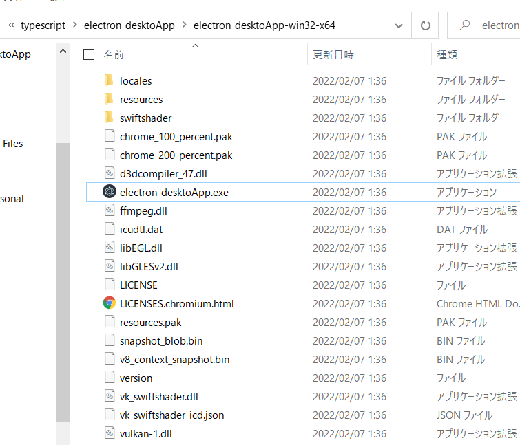

# Electronを使ってDesktopアプリを開発する

[参考元](https://zenn.dev/sprout2000/books/6f6a0bf2fd301c/viewer/13263)

```txt
Electron は、GitHub 社が開発したソフトウェアフレームワークです。

HTML、CSS、JavaScript のような Web 技術を利用して、Windows、macOS、Linux で動作するデスクトップアプリケーションをつくることができます。

Web の技術をある程度すでに習得している人であれば、ほんの少しのプラスアルファをそれに加えるだけでクロスプラットフォームなアプリを実現できるため、これまでの学習を活かすことが可能です。
```

### typeScriptのチュートリアルを実行したい場合

[公式チュートリアル](https://www.electronforge.io/templates/typescript-template)のコマンドを実行することで簡単に.tsプロジェクトが作れるので興味があれば

> npx create-electron-app my-new-app --template=typescript

## 構成
それっぽいデスクトップアプリを動かすまでが目標。

1. Electronを動かすまで
2. アプリアイコンの設定と単一実行ファイル(.exe)の生成まで
3. スタートメニューへの表示とクイックアクセスするまで

### Electronを動かすまで

zip解凍した場合、**Electronアプリの起動**まで手順をskipできる。

#### プロジェクトフォルダの作成
```powershell
$mkdir myApp
$cd myapp
```

#### プロジェクトの初期化
npmコマンドを使ってNode.jsのプロジェクトとして初期化する。
```powershell
PS C:\Develop\typescript\electron_desktoApp> npm init -y
Wrote to C:\Develop\typescript\electron_desktoApp\package.json:

{
  "name": "electron_desktoApp",
  "version": "1.0.0",
  "description": "[参考元](https://zenn.dev/sprout2000/books/6f6a0bf2fd301c/viewer/13263)",
  "main": "index.js",
  "scripts": {
    "test": "echo \"Error: no test specified\" && exit 1"
  },
  "keywords": [],
  "author": "",
  "license": "ISC"
}
```
プロジェクトフォルダ直下にpackage.jsonファイルが生成される。

#### Electronのインストール
**npm install**でプロジェクトにElectronをインストールする。
```powershell
PS C:\Develop\typescript\electron_desktoApp> npm install --save-dev electron

> electron@17.0.0 postinstall C:\Develop\typescript\electron_desktoApp\node_modules\electron
> node install.js

npm notice created a lockfile as package-lock.json. You should commit this file.
npm WARN electron_desktoApp@1.0.0 No repository field.

+ electron@17.0.0
added 86 packages from 96 contributors and audited 86 packages in 14.914s

5 packages are looking for funding
  run `npm fund` for details

found 0 vulnerabilities
```

**Proxy環境でelectronをインストールするには躓くPointがあるので注意**

#### ソースコードの準備
次のindex.html、app.js、main.jsをコピーして、プロジェクトフォルダ直下のファイルとして配置する。

```html
<!-- index.html -->
<!DOCTYPE html>
<html lang="ja">
  <head>
    <meta charset="UTF-8" />
    <meta http-equiv="Content-Security-Policy" content="default-src 'self'" />
    <meta name="viewport" content="width=device-width, initial-scale=1.0" />
    <title>マイアプリ</title>
  </head>
  <body>
    <h1>Hello, world.</h1>

    <script src="app.js"></script>
  </body>
</html>
```

```js
// app.js
console.log('Hello, world.');
```

```js
// main.js
const { app, BrowserWindow } = require('electron');

const createWindow = () => {
  const mainWindow = new BrowserWindow({
    width: 600,
    height: 400,
    title: 'マイアプリ',
  });

  mainWindow.loadFile('index.html');
};

app.once('ready', () => {
  createWindow();
});

app.once('window-all-closed', () => app.quit());
```

ここまでのプロジェクトフォルダ構成

```powershell
- node_moudles
- package.json
- app.js
- main.js
- index.html
```


#### package.jsonの編集
defaultの**package.json**の**main**エントリは**index.js**になっているので、**main.js**に修正する。

#### npmスクリプトの修正
**package.json**の**scripts**エントリに記載されているスクリプトを修正する。

```json
   "scripts": {
     "start": "electron ."
   },
```

> npm run start

コマンドの実行で elctron . が実行される。

#### Electronアプリの起動

```powershell
PS C:\Develop\typescript\electron_desktoApp> npm run start
```



### アプリアイコンの設定と単一実行ファイル(.exe)の生成まで

#### パッケージャのインストール

[electron-packager](https://github.com/electron/electron-packager)をインストールする。

```powershell
PS C:\Develop\typescript\electron_desktoApp> npm install --save-dev electron-packager
```

#### ビルドスクリプトの登録

再度**package.json**のscriptsにelectron-packagerコマンドを追加する。

```json
   "scripts": {
     "start": "electron .",
     "build": "electron-packager ."
   },
```

**npm run build**を実行してパッケージングでexeを生成する。

```powershell
PS C:\Develop\typescript\electron_desktoApp> npm run build

> electron_desktoApp@1.0.0 build C:\Develop\typescript\electron_desktoApp
> electron-packager .

Packaging app for platform win32 x64 using electron v17.0.0
Wrote new app to C:\Develop\typescript\electron_desktoApp\electron_desktoApp-win32-x64
```

**electron_desktoApp-win32-x64** にexeが入っている。



#### アプリ名(ProductName)の変更

アプリ名は**package.json**の**name**プロパティの値になっている(electron_desktopApp.exe)ので、**productName**を追加して自分の好きなアプリ名に変更する。

```json
// package.json
{
  "name": "electron_desktoApp",
  "productName":"winDesktop",
```

再度、**npm run build**することで**winDesktop-win32-x64**フォルダと実行ファイル群ができる。

```powershell
PS C:\Develop\typescript\electron_desktoApp> npm run build

> electron_desktoApp@1.0.0 build C:\Develop\typescript\electron_desktoApp
> electron-packager .

Packaging app for platform win32 x64 using electron v17.0.0
Wrote new app to C:\Develop\typescript\electron_desktoApp\winDesktop-win32-x64
```

#### アプリアイコンの変更

windowsでは**ico形式**の画像を用意する。

**package.json**の**buildスクリプトを次のように変更する。

```json
   "scripts": {
     "start": "electron .",
     "build": "electron-packager . --icon=ico/run_gopher.ico --overwrite"
   },
```

**winDesktop-win32-x64**をzip化して共有すれば、他のwindowsユーザーもexeを実行できる。

### スタートメニューへの表示とクイックアクセスするまで

#### 